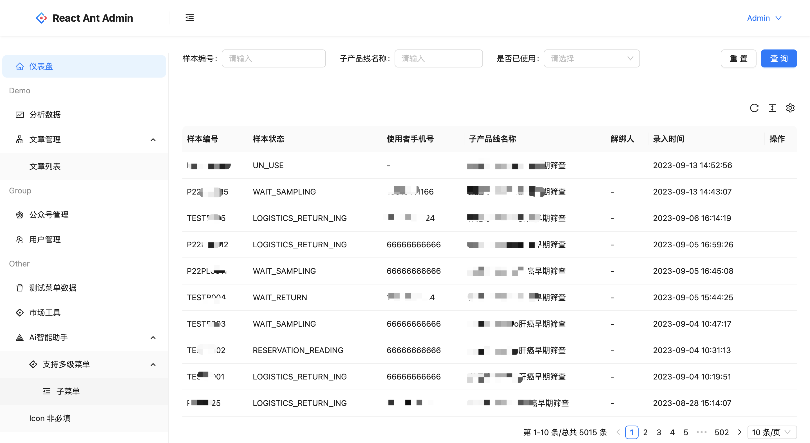

# React + TS + Vite + Antd + Zustand + ReactRouterDom + Axios

## 追求极简实用，杜绝花里胡哨。

> 番外： [MareWood](https://github.com/xusenlin/MareWood) 是一个 Go 开发的轻量级前端部署工具,可以很灵活的配置各种打包部署环境并提供访问,特别是远程的时候，方便后端和测试使用。
> 这里有vue版本的 https://github.com/xusenlin/vue-element-ui-admin


## 介绍
- 干净简单职责清晰的一个后台模板，开箱即用。
- 简单处理Axios以方便json、formData、文件上传的操作
- 支持 ProTable 组件的Axios封装，无缝对接 Aip

## 约定
我们约定所有的接口(包括请求和文件上传各种api)和接口相关的数据类型全部定义在api目录，
在api目录目前可以导入3个请求的封装，分别是request、requestOk、requestProTable。
```js
import { request,requestOk,requestProTable } from "@/utils/request.ts";
```
request的请求没有任何拦截，requestOk做了业务拦截，状态码不对自动报错，而requestProTable请求是针对ant ProTable组件的封装。
可以和ProTable组件无缝对接，具体查看views/dashboard下面演示


## 打包环境
目前支持测试、预发布、本地、正式环境的打包，配置好相应的请求，打包自动选择。如果使用配合使用 MareWood ，那么我只负责提交分支和代码，任何分支和环境的预览地址都可以打包。


